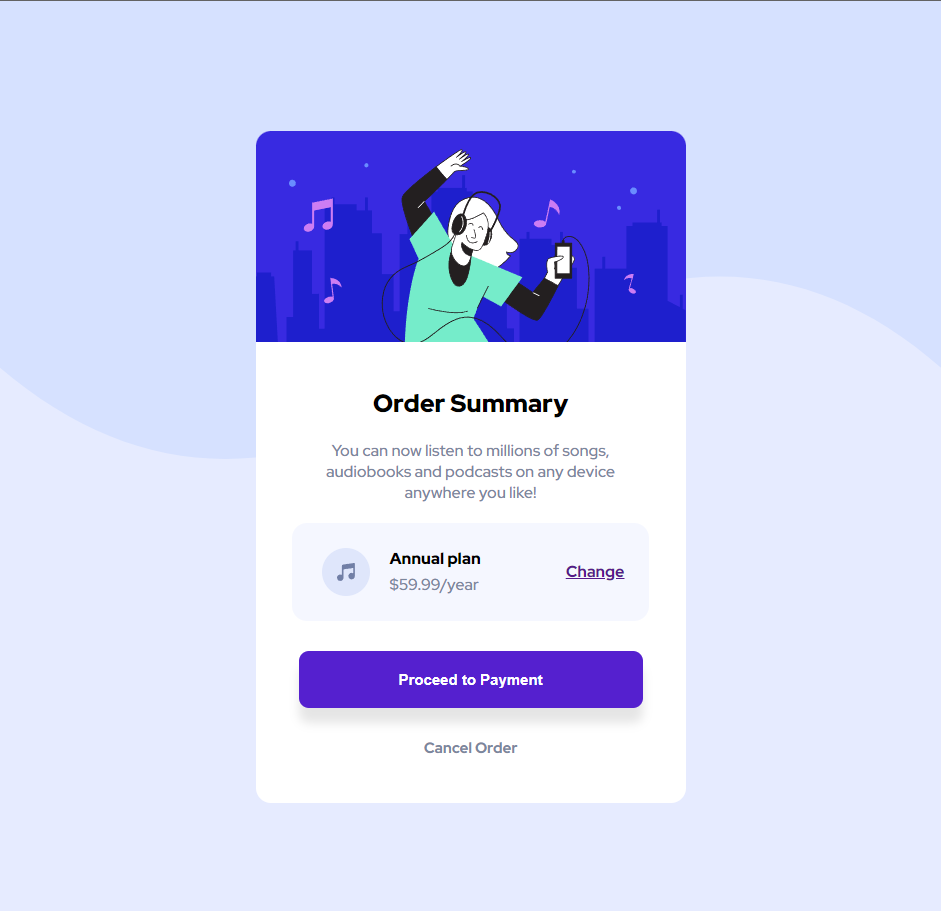

# Frontend Metor - Order Summary card solution 

This is a solution to the [Order summary card challenge on Frontend Mentor](https://www.frontendmentor.io/challenges/order-summary-component-QlPmajDUj). Frontend Mentor challenges help you improve your coding skills by building realistic projects. 

## Table of contents

- [Overview](#overview)
  - [The challenge](#the-challenge)
  - [Screenshot](#screenshot)
  - [Links](#links)
- [My process](#my-process)
  - [Built with](#built-with)
  - [What I learned](#what-i-learned)
  - [Useful resources](#useful-resources)
- [Author](#author)
- [Acknowledgments](#acknowledgments)

## Overview

### The challenge

Users should be able to:

- See hover states for interactive elements

### Screenshot

### Links

- Solution URL: [Add solution URL here](https://your-solution-url.com)
- Live Site URL: [Add live site URL here](https://your-live-site-url.com)

## My process

### Built with 

- HTML
- CSS 
- Flexbox

### What I learned 

I learned how to use the hover effects and the imporatance of the usage of div tags. Hover effects enhanced interactivity and provided more engagin experiences. 

### 
- Chatgpt - ChatGPT has been invaluable in helping me develop my skills. It provided guidance and assistance in areas where I needed improvement, and it helped me focus on minute details that I might have overlooked. I plan to continue utilizing ChatGPT as a resource to enhance my skills and deepen my understanding of various concepts in web development.

## Author 

Manamkuzhyiel Kuriakose Anson 
- Fontend Mentor - [@Anson246](https://www.frontendmentor.io/profile/Anson246)

## Acknowledgments 

I would like to thank my friends(Decider, Afzal) whoever introduced me to this project and guided me through this project.